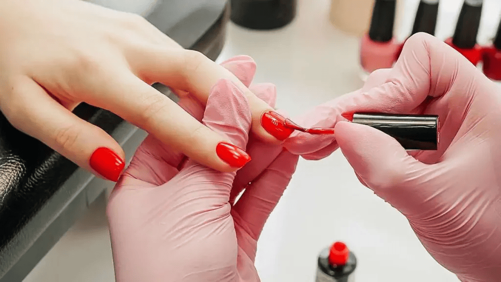
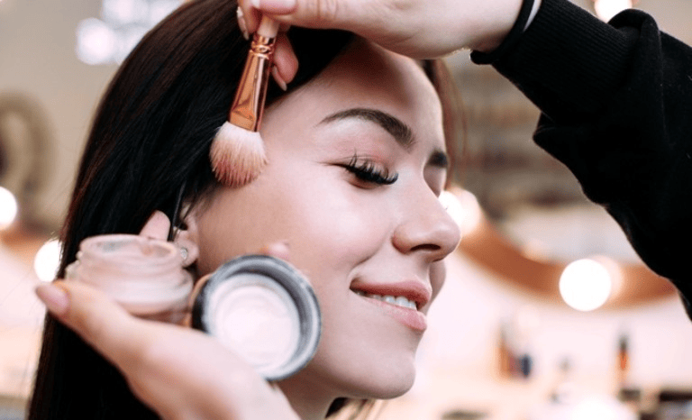

# Documentação do Código HTML: Salão de Beleza Levic

Este código HTML descreve a estrutura de uma página para o "Salão de Beleza Levic", incluindo a navegação, apresentação de serviços, localização, e informações de contato. Ele utiliza recursos como o Google Maps e ícones do FontAwesome.

## Estrutura do Documento

### 1. **Cabeçalho (Head)**
O cabeçalho contém os metadados e links externos utilizados na página.

- **Ícone da Página**: O favicon é um ícone de imagem localizado em `./assets/images/logo.jpg`.
- **Charset**: Definido como UTF-8 para suportar caracteres especiais da língua portuguesa.
- **Viewport**: Configuração para responsividade em dispositivos móveis (`width=device-width, initial-scale=1.0`).
- **Título**: O título da página é "Salão de Beleza Levic".
- **Links de CSS**:
  - Font Awesome para ícones (`https://cdnjs.cloudflare.com/ajax/libs/font-awesome/5.15.3/css/all.min.css`).
  - Arquivo de estilo local (`./assets/css/style.css`).

### 2. **Corpo (Body)**
O corpo da página contém a estrutura principal da interface.

#### a. **Cabeçalho da Página**
```html
<header class="header">
    
    <div class="container">
        <button class="navbar-toggler" id="toggleButton" aria-label="Toggle navigation">
            <span class="hamburguer"></span>
            <span class="hamburguer"></span>
            <span class="hamburguer"></span>
        </button>
        <nav class="navbar" id="navbarNav">
            <ul class="nav-list">
                <li class="nav-item"><a href="./index.html" class="nav-link active">Home</a></li>
                <li class="nav-item"><a href="./quem_somos.html" class="nav-link">Quem Somos</a></li>
                <li class="nav-item"><a href="./servicos.html" class="nav-link">Serviços</a></li>
                <li class="nav-item"><a href="./produtos.html" class="nav-link">Produtos</a></li>
                <li class="nav-item"><a href="./orcamentos.html" class="nav-link">Orçamentos</a></li>
                <li class="nav-item"><a href="./contato.html" class="nav-link">Contato</a></li>
            </ul>
        </nav>
    </div>
</header>
```
- Exibe o logo do salão e um menu de navegação com links para as principais páginas do site.
- O menu inclui links para as páginas "Home", "Quem Somos", "Serviços", "Produtos", "Orçamentos" e "Contato".
- O botão de navegação (hamburguer) está configurado para dispositivos móveis.

#### b. **Seção Principal (Main)**
A seção principal contém o banner de boas-vindas, informações sobre os serviços e a localização do salão.

##### i. **Banner**
```html
<section class="banner">
    <h1 class="banner-title">Bem-vindo ao Salão Levic!</h1>
    <p class="banner-description">Onde transformamos sua beleza com nossos serviços, tudo com carinho e profissionalismo!</p>
    <a class="cta-button" href="./orcamentos.html">Reserve Seu Momento</a>
</section>
```
- Exibe uma saudação ao usuário e uma breve descrição dos serviços do salão.
- Um botão com o link para a página de orçamentos (`./orcamentos.html`), incentivando o usuário a agendar um serviço.

##### ii. **Serviços**
```html
<section class="services">
    <div class="container">
        <div class="service-grid">
            <div class="service-card">
                
                <h3 class="service-title">Fazemos Cabelos e Penteados.</h3>
                <p class="service-description">Oferecemos serviços especializados em cabelos e penteados, transformando seu visual com estilo e criatividade.</p>
            </div>
            <div class="service-card">
                
                <h3 class="service-title">Fazemos Manicure e Pedicure.</h3>
                <p class="service-description">Oferecemos serviços de manicure e pedicure para deixar suas unhas sempre impecáveis.</p>
            </div>
            <div class="service-card">
                
                <h3 class="service-title">Fazemos Maquiagens Profissionais.</h3>
                <p class="service-description">Oferecemos maquiagens profissionais que realçam sua beleza natural e atendem a todas as ocasiões.</p>
            </div>
            <div class="service-card">
                
                <h3 class="service-title">Fazemos Massagens.</h3>
                <p class="service-description">Oferecemos uma variedade de massagens para promover relaxamento e bem-estar.</p>
            </div>
        </div>
    </div>
</section>
```
- A seção apresenta uma grade de serviços oferecidos pelo salão: cabelo e penteado, manicure e pedicure, maquiagem profissional e massagens.
- Cada serviço é apresentado com uma imagem, título e descrição.

##### iii. **Localização**
```html
<section class="location">
    <h1 class="location-title">Nossa Localização</h1>
    <div class="map-container">
        <iframe width="773" height="331" id="gmap_canvas" src="https://maps.google.com/maps?q=Av.+Terezinha+Campos+Waack%2C+415%2C+Jardim+Alexandre+Campos%2C+Uberaba%2FMG%2C+38020-040&t=&z=20&ie=UTF8&iwloc=&output=embed" frameborder="0" scrolling="no" marginheight="0" marginwidth="0"></iframe>
    </div>
</section>
```
- Exibe o mapa interativo do Google Maps com a localização do salão, utilizando um iframe.

#### c. **Rodapé (Footer)**
```html
<footer class="footer">
    <div class="footer-container">
        
        <h2 class="footer-title">Studio</h2>
        <p>Email:<a class="footer-links" href="mailto:levicsalonclinique@hotmail.com">levicsalonclinique@hotmail.com</a></p>
        <p>Tel: 34 3522-1880</p>
        <p>Av. Terezinha Campos Waack, 415 - Jardim Alexandre Campos,<br> Uberaba - MG, 38020-040</p>
        <div class="social-links">
            <div class="social-link"><i class="fab fa-twitter"></i><a class="footer-links" href="">Siga no Twitter</a></div>
            <div class="social-link"><i class="fab fa-instagram"></i><a class="footer-links" href="">Siga no Instagram</a></div>
            <div class="social-link"><i class="fab fa-facebook"></i><a class="footer-links" href="">Acompanhe no Facebook</a></div>
        </div>
        <div class="salon-hours">
            <h2 class="hours-title">Horário | Salão</h2>
            <p>Segunda à sábado: 9h às 18h;</p>
            <p>Agende online no link abaixo:</p>
            <div><a href="./orcamentos.html"><button class="cta-button">Agende Online</button></a></div>
        </div>
    </div>
</footer>
```
- Exibe o logo do salão, informações de contato (e-mail e telefone), endereço completo e links para redes sociais (Twitter, Instagram, Facebook).
- Inclui também o horário de funcionamento do salão e um botão de chamada para ação para agendamento online.

### 3. **JavaScript**
```html
<script src="./assets/js/script.js"></script>
```
- Link para o arquivo JavaScript (`./assets/js/script.js`), responsável por funcionalidades interativas, como o menu hamburguer.

---
